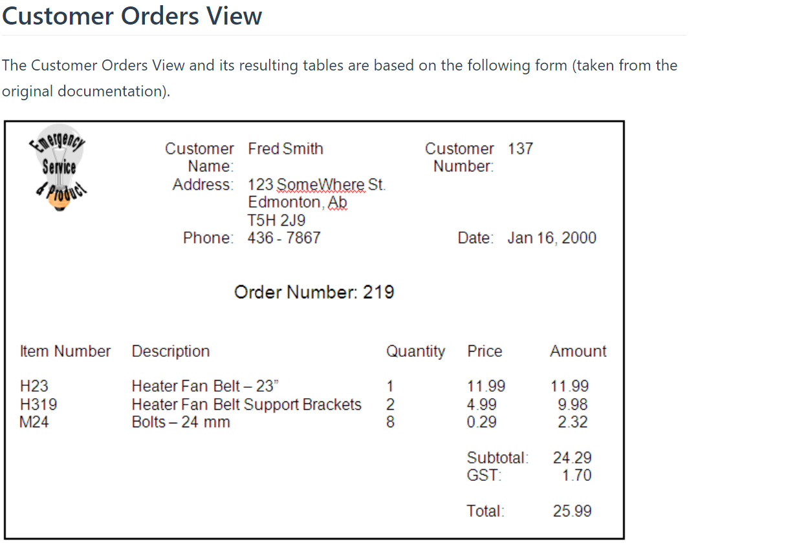

# ESP - Spec 1


The following screen snapshot depicts the form that 


---

## ERD


---

### CRUD Page - Manage Customers

### Form to Create Orders


---


```csharp
// Code-first EF w. 1 entity:
from cust in Customers
where cust.Name.Contains("Fre")
select cust
//
context.Products.Find(productId)
//
var ord = context.Orders.Add(new Order());
foreach(var item in SoldProducts)
{
    // Add an item to the order
    // reduce the inventory quantity
}
```
