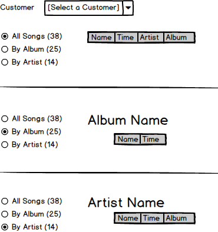

# Chinook Tunes

----

## Customer's Song Listings

Given the concepts in the following mockup, we want to create a web page that shows the customer's songs listed in various ways.

### Part 1 - Queries

We would have to build queries for the various views of the songs. Create LINQ queries in LinqPad for the following:

- Info to populate the Drop-Down to select the customer
- Info on the number of songs/albums/artists for the customer's purchased tracks
- Details on the songs listed depending on the display formatting:
  - All Songs
  - By Album
  - By Artist

When creating the queries for the song details, we will need to have View Model classes to represent the data that we will send to the Presentation Layer of our application. Consider making those LinqPad queries in the *C# Program* format so you can use them directly instead of using anonymous methods. **This will help you prepare for applying the LinqPad code to your Visual Studio solution.**

----
