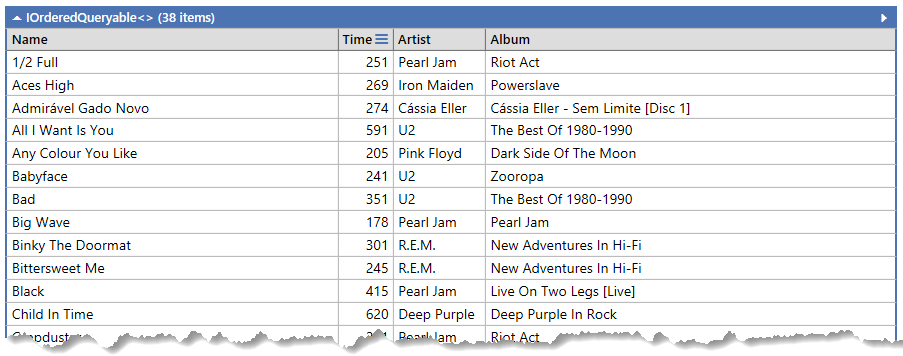
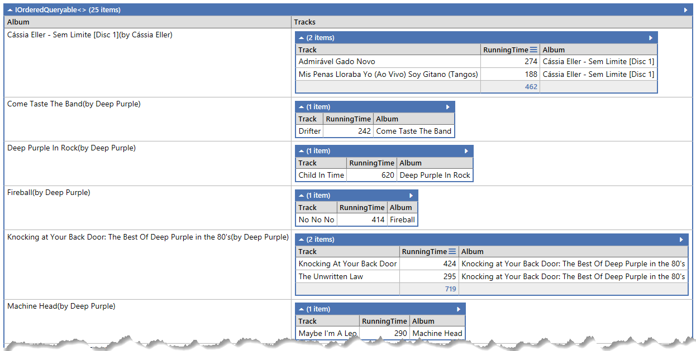
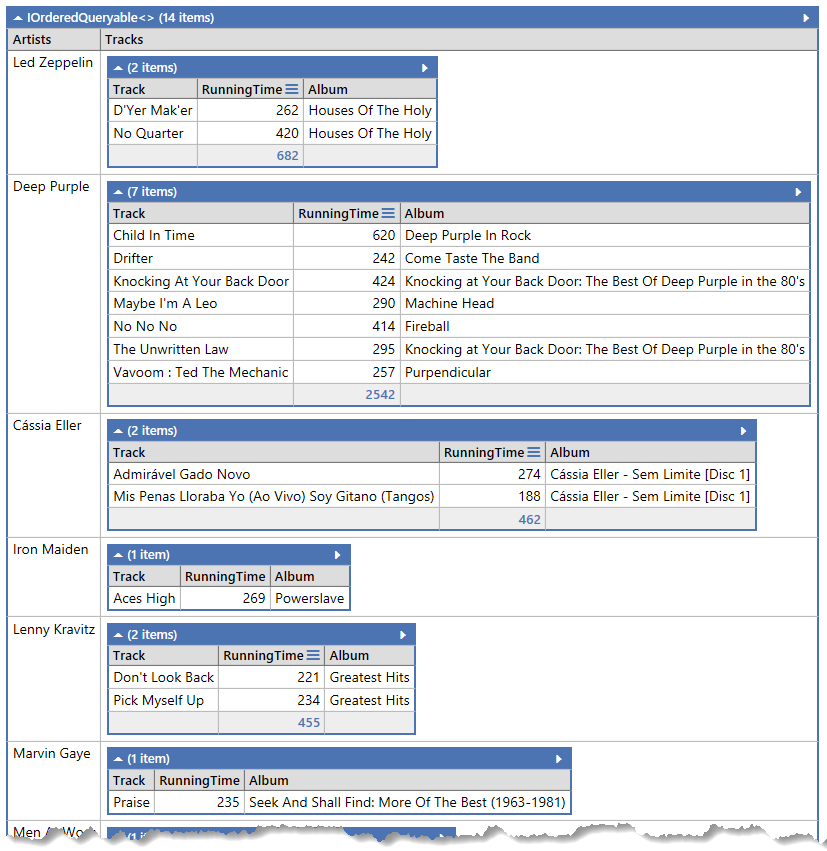

# Chinook Tunes

----

## Customer's Song Listings

Given the concepts in the following mockup, we want to create a web page that shows the customer's songs listed in various ways.

### Part 1 - Queries

We would have to build queries for the various views of the songs. Create LINQ queries in LinqPad for the following:

- Info to populate the Drop-Down to select the customer
- Info on the number of songs/albums/artists for the customer's purchased tracks
- Details on the songs listed depending on the display formatting:
  - All Songs
  - By Album
  - By Artist

When creating the queries for the song details, we will need to have View Model classes to represent the data that we will send to the Presentation Layer of our application. Consider making those LinqPad queries in the *C# Program* format so you can use them directly instead of using anonymous methods. **This will help you prepare for applying the LinqPad code to your Visual Studio solution.**

Here's some sample data that comes back when you look for the song data for the customer ID of `10`.

> All Tracks
> 
> 

You will need grouping for the other result sets. Treat these as different queries.

> By Album
> 
> 

> By Artist
> 
> 

### Part 2 - Transfer to BLL

Once the LinqPad queries are giving you the data you want, apply that code to your BLL.

- Add the View Model classes designed in LinqPad to your View Models folder in the **ChinookTunes** project.
- Create a BLL class called **CustomerController** that has methods to do the following
  - List all the customer
  - Get a summary of counts for the customer's purchased songs (all tracks, distinct album count, distinct artist count)
  - List all customer tracks
  - List all customer tracks by album
  - List all customer tracks by artist
- Transfer your LinqPad code to the BLL methods to retrieve the requested data. Remember that you will need to use your `DbContext` class for the LINQ query.

### Part 3 - Build the UI

----
