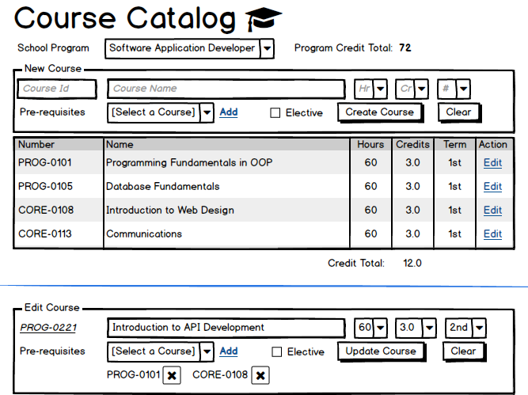

# Hire Learning &rarr; 

**Kode Akademy** is an institution offering face-to-face and remote learning opportunities. The scenarios represented here reflect an initial development of the system and only cover part of the entire application's functionality.

- [**Course Catalog Management**](#course-catalog-management) - Manage the list of courses for a given Program of Study.
- [**Appendix**](#appendix)

----

## Course Catalog Management

Every educational program in the institution will have a set of courses dedicated to that program of study. Those courses comprise the program's **Course Catalog**. Administrators for the institution use the following screen mock-up to add and edit the courses in a school program.



The following business rules must be enforced by the system:

- The combination of Hours/Credits must exist in the **CreditModels** for the program's **GovernanceModel**.
- Edited courses cannot change the course number (that is fixed when a course is created/added).
- Course numbers and names must be unique across the whole institution (regardless of the program of study).
- There can only be a maximum of three pre-requisites per course.
- Pre-requisite courses must be offered in an initial term that is before the term of the dependent course. For example, the **`PROG-0221`** is in the 2nd term, which means the pre-requisite courses have to be 1st term courses.
- Term numbers begin at 1 and run up to the number of terms for the whole program. This is determined by a combination of the program's *Accreditation* and the *Term Model* governing the program's delivery.

  For example, given a *two-year Diploma* offered in a *Trimester* (2-term/year) model, there will be a total of four terms: **1st**, **2nd**, **3rd**, and **4th**.

  - **Term Models** are reflected using the following enumeration:

    ```csharp
    public enum TermModel { Semester = 1, Trimester, Quarter }
    ```

    - Both the Semester and Trimester have two terms per year. The Quarter term model has three terms per year. (Summer terms are not counted for the institution.)
  - **Accreditation** is reflected using the following enumeration:

    ```csharp
    public enum Accreditation { None, Certificate, Diploma, AppliedDegree }
    ```

    - Certificate programs are 1-year; Diploma programs are 2-year, Applied Degrees are 3-year

The following ERD represents the tables relevant for the Course Catalog management view.


### Implementation Plan

#### UI Events

- **`Page_Load()`** - Various `<asp:DropDownList>` controls will be populated via `<asp:ObjectDataSource>` controls hooked up to the following methods.
  - School Programs will be populated by `ListSchoolPrograms()`.
  - Course Hours will be populated by `ListCourseHours(int programId)`.
  - Credits will be populated by `ListCourseCredits(int programId)`.
  - Term numbers will be populated by `ListTerms(int programId)`.
  - Pre-requisite Courses will be populated by `ListSchoolCourseSummaries(int programId)`.
- **`_OnSelectedIndexChanged()`** - The drop-down for the school program will automatically post-back to
  - Trigger an `<asp:ObjectDataSource>` to populate a `<asp:ListView>` control with data from the `List<SchoolCourse> ListSchoolCourses(int programId)` method.
  - Call the `GetRequiredCredits(int programId)` to get the program's `CreditThreshold`.
- **`_OnItemCommand()`** - The List View will handle the calls to the BLL for the following **CommandName** values.
  - **Insert** - Call the `AddCourse(int programId, CourseSpecification course)` BLL method.
  - **Update** - Call the `UpdateCourse(int programId, CourseSpecification course)` BLL method.
- The List View control will have a nested List View for **Pre-requisite Courses** that will **not** affect the database, but handle the **Add** and **Delete** commands to add/remove pre-requisite courses in the nested List View directly.

#### BLL Methods

The following methods of the **CourseCatalogController** support the functionality of this form.

##### Drop-Down Lists

```csharp
public List<KeyValueOption<int>> ListSchoolPrograms()
{ /* query ProgramsOfStudy */ }

public List<KeyValueOption<int>> ListSchoolCourseSummaries(int programId)
{ /* query Courses */ }

public List<KeyValueOption<byte>> ListCourseHours(int programId)
{ /* query CreditModels for distinct Hours */ }

public List<KeyValueOption<decimal>> ListCourseCredits(int programId)
{ /* query CreditModels for distinct Credits */ }

public List<KeyValueOption<string>> ListTerms(int programId)
{ /* query GovernanceModels and ProgramsOfStudy (with math) */ }
```

##### Query Methods

```csharp
public byte GetRequiredCredits(int programId)
{ /* query ProgramsOfStudy */ }

public List<SchoolCourse> ListSchoolCourses(int programId)
{ /* query Courses and Prerequisites */ }
```

##### Command Methods

```csharp
public void AddCourse(int programId, CourseSpecification course)
{ /* command affecting Courses and Prerequisites */ }

public void UpdateCourse(int programId, CourseSpecification course)
{ /* command affecting Courses and Prerequisites */ }
```

#### View Models

The following enumerations have been modelled so that their underlying values will match the requirements of their related database columns. In addition, the shared `KeyValueOption<T>` class is used for information in Drop Down lists and similar controls.

```csharp
public enum TermModel : Byte
{ Semester = 1, Trimester, Quarter }

public enum Accreditation : Byte
{ None, Certificate, Diploma, AppliedDegree }
```

##### Query Models

The query models are based on the data columns highlighted in the following ERD:


```csharp
public class SchoolCourse
{
    public int CourseId { get; set; }
    public string Number { get; set; }
    public string Name { get; set; }
    public byte Hours { get; set; }
    public decimal Credits { get; set; }
    public byte Term { get; set; }
    public bool IsElective { get; set; }
    public IEnumerable<CourseReference> Prerequisites { get; set; }
}
```

```csharp
public class CourseReference
{
    public int CourseId { get; set; }
    public string Number { get; set; }
}
```

##### Command Models

The command models are based on the data columns highlighted in the following ERD:


> **Note:** There is a lot of similarity between the Query class `SchoolCourse` and the following Command class `CourseSpecification`. Despite the similarities, these are being modeled as distinct classes in order to maintain the **Command-Query Responsibility Segregation** (*CQRS*) principle.

```csharp
public class CourseSpecification
{
    public int CourseId { get; set; }
    public string Number { get; set; }
    public string Name { get; set; }
    public byte Hours { get; set; }
    public decimal Credits { get; set; }
    public byte Term { get; set; }
    public bool IsElective { get; set; }
    public IEnumerable<int> Prerequisites { get; set; }
}
```

----

## Appendix

### `KeyValueOption<T>`

```csharp
/// <summary>
/// This View Model class is ideal for representing data that will ultimately be displayed in a DropDownList, RadioButtonList or CheckBoxList.
/// </summary>
/// <typeparam name="T">Native data type of the Key</typeparam>
public sealed class KeyValueOption<T>
{
    ///<summary>Key value</summary>
    public T Key { private get; set; }
    ///<summary>String representation of the key value</summary>
    public string DisplayValue => Key.ToString();
    ///<summary>Text representation of the value associated with the Key</summary>
    public string DisplayText { get; set; }
}
```
