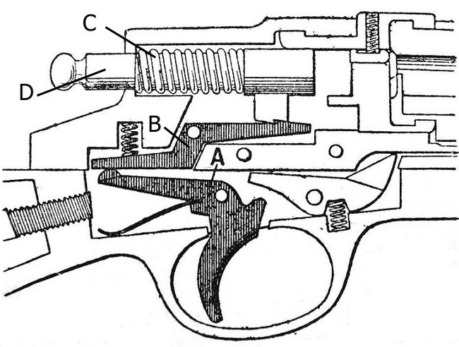
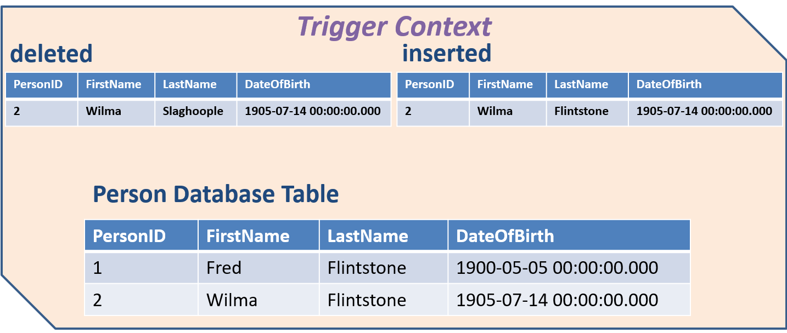

# TRIGGERS Summary

In SQL, **Triggers** can be thought of as specialized stored procedures that are only invoked by the database in response to individual INSERT/UPDATE/DELETE statements. They have no parameters, cannot be explicitly invoked, and are tied to the database table on which they are created.

## Uses of Triggers

Triggers have many uses, but the key ones are to:

1. **Create an audit trail (a record of the change history of data in a database).**
1. **Automate processes where changes to one table will cause changes to some other table(s).**
1. **Enforce business rules too complex to enforce with a `CHECK` constraint.**
1. **Prevent an Insert, Update, and/or Delete from happening on a table.**
1. Enforce table relationships when a foreign key constraint does not exist.
1. Enforce referential integrity across databases, or even servers.



## Types of Triggers

There are two general categories of DML triggers

- **`FOR`** / **`AFTER`** - These triggers run after the database server has performed the INSERT/UPDATE/DELETE statement. These triggers have the ability to reverse (`ROLLBACK`) the DML statement.
- `INSTEAD OF` - (*We will **not** be using these in this course.*) These triggers are replacements for the standard INSERT/UPDATE/DELETE DML actions.

## The Execution Context of Triggers

There are a number of facts to keep in mind regarding triggers in SQL.

- Each trigger is *attached* to a single table. Each table can have multiple triggers (any combination of INSERT, UPDATE, and DELETE).
- You *cannot* explicitly invoke (call) triggers; they are called by the DBMS in response to an INSERT/UPDATE/DELETE statement.
- Triggers *do not* have parameters.

When a trigger is executed, the database's table has **ALREADY** changed (within a transaction started by SQL Server). Also, SQL Server creates two (2) temporary tables named "Inserted" and "Deleted"; these tables will have exactly the same column names/types as the trigger's table. The content of these two tables will depend on which DML statement is executed.

| DML Operation | *`inserted`* Table Contents  | *`deleted`* Table Contents | Trigger (Target) Table  |
|---------------|------------------------------|----------------------------|-------------------------|
| **`INSERT`**  | Newly inserted rows          | Empty                      | New rows and all previously existing rows. |
| **`DELETE`**  | Empty                        | Copy of deleted rows       | All rows that were not deleted.            |
| **`UPDATE`**  | "After update" values of changed rows | "Before update" values of affected rows | After version of changed rows and all other rows not affected by the operation |

Take, for example, the following **Person** table.


Imagine that the following statement is issued against that table.

```sql
UPDATE Person SET LastName = 'Flintstone'
WHERE  FirstName = 'Wilma' AND LastName = 'Slaghoople'
```

If a trigger was added to that table for the `UPDATE` operation, then the trigger's context would have the following data in the deleted, inserted, and Person tables.



## Processing Inside a Trigger

Since it is quite possible that a INSERT, UPDATE, or DELETE statement will not affect any rows, it's important to account for that in the logic of your trigger.

- The number of rows affected by the current DML is in **`@@Rowcount`**
- The logic of the trigger **MUST** account for **0** rows OR affects **1** row OR affects **Many** rows.

It's also important to recognize that the trigger runs inside of a transaction that was created by the RDBMS when the DML statement was started. This means that you should **not** try to begin or commit any transactions. You are allowed, however, to `ROLLBACK` the transaction started by the RDBMS for DML statement. In fact, that's a common objective of trigger processing for those triggers that exist to enforce business rules or prevent DML actions on tables.

Another useful item when processing within a trigger is the **Update Function**. This is not to be confused with the `UPDATE` DML statement. The **`UPDATE(column_name)`** function is a special function which can only be used in triggers, and its purpose is to determine if the value has changed for a specific column as a result of the DML statement. During an INSERT or DELETE statement, all the columns are modified for the affected row(s). But for an `UPDATE` statement, it is possible that only *some* of the column values have been changed. The **Update Function** is useful for testing to see if a particular column value has changed.

## Triggers and Transactions

Remember that within a Trigger, you do ***not*** create your own transactions. Instead, you are already inside a "mini" transaction that the database server has started when it began processing the individual insert, update, or delete. Inside that Trigger context, the database server generates two temporary tables - `inserted` and `deleted` - where it fills in the effective changes it has done on the Trigger's table. Within the Trigger context, you are permitted to `ROLLBACK TRANSACTION` to "un-do" the DML statement and revert the table's data back to what it was before the DML statement.

In the case of a larger context, such as a stored procedure, where you might define your own transaction with `BEGIN TRANSACTION`, there are no "temporary" tables that SQL gives you to work with. What SQL does give you are the `@@ERROR` and `@@ROWCOUNT` variables so you can see the general effect of your individual DML statements. It is based on these values that we do our `ROLLBACK` or `COMMIT` statements.
