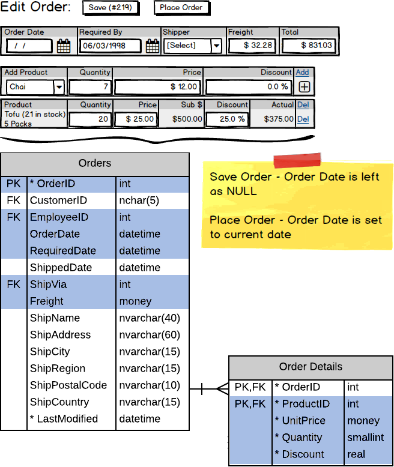

[drag=100 40, drop=0 0]
# Customer Orders

## Planning the Implementation

[drag=50 60, drop=0 40]


[drag=50 60, drop=-0 40]


----

# Customer Orders (The Backstory)

The customers of Northwind Traders place their orders by phone or fax. Employees then enter the details of the order into the system via the **Customer Order Form** (from the *Sales* menu item on the website).

The form allows employees to create new orders and view previous orders. Any order whose *Order Date* has been set cannot be modified, because that order has been *"Placed"*.

An order without an Order Date can be modified. It may be an order that is *"In Progress"* (saved, but not placed), or an entirely new order.

----

[drag=100 20, drop=0 0]
## The Form Design

[drag=50 80, drop=0 20,set=text-left]

Customers of Northwind Traders place their orders by phone or fax.

Employees then enter the order into the **Customer Order Form**.


[drag=50 80, drop=-0 20]


---

# Customer Orders - Design Plan

> **Notes:** Columns highlighted yellow on ERDs are for queries, while columns highlighted blue are for commands.

## Page Load

> **Customer Selection** (`<asp:DropDownList>`)

```csharp
// SalesController class
[DataObjectMethod(DataObjectMethodType.Select)]
public List<KeyValueOption> ListCustomerNames()
```


## Selecting a Customer

> **Customer Summary Info** (disabled textboxes)

```csharp
// SalesController class
public CustomerSummary GetCustomerSummary(string customerId)
```

> **Order History Filters** (`<asp:RadioButtonList>`)

```csharp
// SalesController class
[DataObjectMethod(DataObjectMethodType.Select)]
public List<KeyValueOption> GetOrderHistoryFilters()
```

> **Order History** (`<asp:GridView>`)

```csharp
// SalesController class
[DataObjectMethod(DataObjectMethodType.Select)]
public List<CustomerOrder> GetOrdersByCustomer(string customerId, string filter)
```


----

## Starting New/Existing Order

Both the new and existing ("open") customer orders involve querying data from multiple tables.


> **Shippers** (`<asp:DropDownList>`)

```csharp
[DataObjectMethod(DataObjectMethodType.Select)]
public List<KeyValueOption> GetShippers()
```

> **Add Products** (`<asp:DropDownList>`) - filtered to only show products not currently on the order

```csharp
// SalesController class
[DataObjectMethod(DataObjectMethodType.Select)]
public List<KeyValueOption> GetProducts()
```

### Existing Order

> **Select Existing Order** (GridView's `SelectedIndexChanged` event)

```csharp
// SalesController class
public CustomerOrderWithDetails GetExistingOrder(int orderId)
```

### New Order

> **New Order** button (`<asp:ListView>` is an empty list of `CustomerOrderWithDetails` POCO class)


----

## Saving Order

Saving the order means gathering all the order data from the form and calling a single BLL method to perform the transaction.

```csharp
// SalesController class
public void Save(EditCustomerOrder order)
```



----

## Placing Customer Order

Placing the order also means gathering all the order data from the form and calling a single BLL method to perform a transaction.

```csharp
// SalesController class
public void PlaceOrder(EditCustomerOrder order)
```
