# Implementation Planning

As a developer, it's important to take the time to plan out how you will implement a given UI design. Most importantly, you need to think of the **business processes** that lie behind the User Interface (UI) design and plan your implementations according to those processes.

**Business processes** are those requirements for work to be done for any given use case. Business processes may touch various parts of the database at the same time. When these involve making *changes* to a database, the business processes will often define certain "units of work" that have to happen as a whole. That is, in making changes to the database, those changes need to occur as a **transaction** where they either succeed or fail as a group.

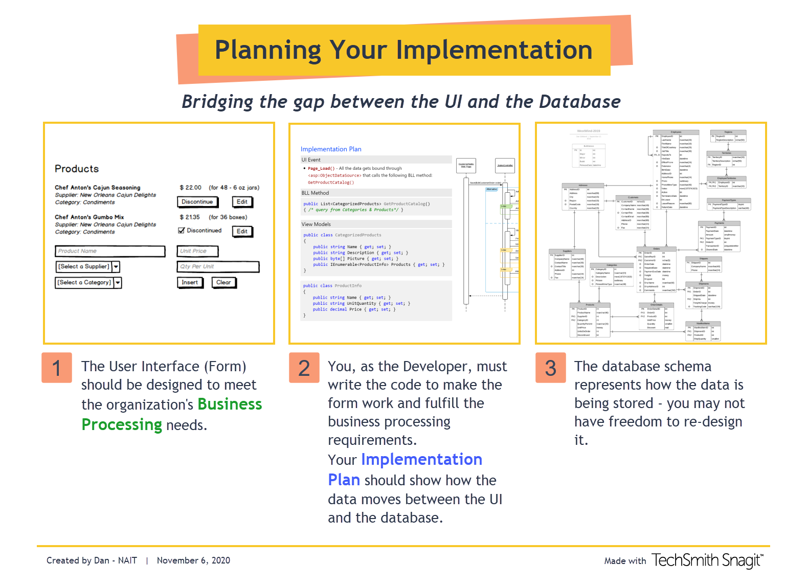

It's not unusual for the UI and database designs to be a "fixed" reality for the developer. If you are part of a larger organization, there may be Business Analysts, Designers and DBAs who make all the decisions about what business processes are needed (Analysts), how the data will be stored (DBAs) and what the UI will look like (Designers).

What you *will* have to do, as a programmer, is **make it work**. And for that, you will have to do some **planning**. You need to think about things such as

- What are the ViewModels for
  - Searching the database (**Queries**)
  - Modifying the database (**Commands**)
- What are the BLL method signatures
- What are the distinct events in the UI

The following examples demonstrate one way of mapping out your **Implementation Plan**.

- [**Product Catalog**](#product-catalog) - Presents a view-only list of products sold by *West-Wind Wholesale &reg;*.
- [**Manage Inventory**](#manage-inventory) - Allows limited editing of the Product Catalog.
- [**Customer Orders**](#customer-orders) - Customers of *West-Wind Wholesale &reg;* place their orders by phone or fax. Employees then enter the details of the order into the system via the **Customer Order Form**
- [**Order Processing**](#order-processing) - Orders are shipped directly from our suppliers to our customers. As such, suppliers log onto our system to see what orders there are for the products that they provide.

## Common View Models

In all the examples supplied in this discussion, the following View Model class will be used for situations related to DropDownList, RadioButtonList and CheckBoxList controls.

```csharp
/// <summary>
/// A general-purpose class for binding with a DropDownList or similar control.
/// </summary>
public class SelectionItem
{
    /// <summary>
    /// Gets or sets the identifier value.
    /// </summary>
    /// <value>
    /// The identifier value.
    /// </value>
    public string IDValue { get; set; }
    /// <summary>
    /// Gets or sets the display text.
    /// </summary>
    /// <value>
    /// The display text.
    /// </value>
    public string DisplayText { get; set; }
}
```

----

<div class="divider"></div>

----

# Product Catalog

The **Product Catalog** presents a view-only list of products sold by ***West-Wind Wholesale &reg;***. Customers can view this list as they plan out their orders. *(At present, all our customers either phone-in or fax their orders to us, and our sales representatives enter the orders into our system.)*

The designers have created the following mock-up that needs to be implemented.


Given the mock-up, an examination of the ERD for the database reveals that only certain information is needed for the page. This becomes the basis for the developer's **implementation plan**.

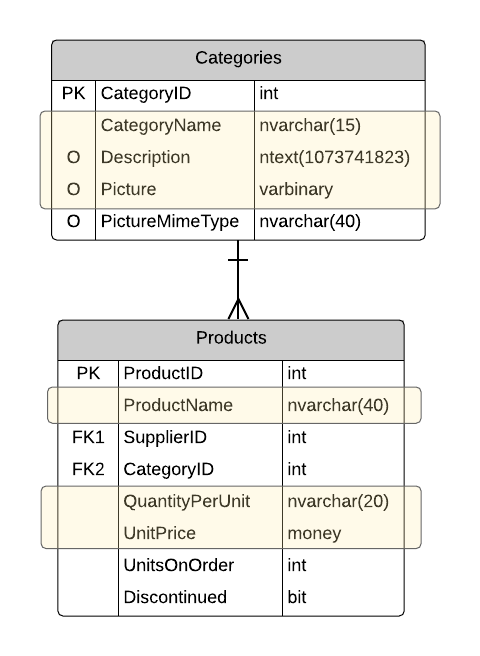

The **implementation plan** must clearly indicate the connections between the *form events* and the *BLL methods* as well as the *view models* involved. It's like a "map" that guides your actual coding.

----

##  Implementation Plan

### UI Event

- **`Page_Load()`** - All the data gets bound through `<asp:ObjectDataSource>` that calls the following BLL method: `GetProductCatalog()`

### BLL Method

The BLL will consist of a **`ProductCatalogController`** supporting the following methods:

```csharp
public List<CategorizedProducts> GetProductCatalog()
{ /* query from Categories & Products */ }
```

### View Models

```csharp
public class CategorizedProducts
{
    public string Name { get; set; }
    public string Description { get; set; }
    public byte[] Picture { get; set; }
    public IEnumerable<ProductInfo> Products { get; set; }
}
```

```csharp
public class ProductInfo
{
    public string Name { get; set; }
    public string UnitQuantity { get; set; }
    public decimal Price { get; set; }
}
```

----

<div class="divider"></div>

----

# Manage Inventory

----

The **Manage Inventory** form allows managers to add new products to the Product Catalog as well as change the pricing for existing products. They also need the ability to discontinue products that are no longer available.

Because of the increasing size of our product catalog, the form will only show products that match certain search criteria. The following form illustrates the overall design that has to be implemented.


When editing any given product, the form should allow changes to be made according to the following mockup.


----

### Examining the Database

The list of existing products needs to draw information from the **Suppliers**, **Categories** and **Products** tables.

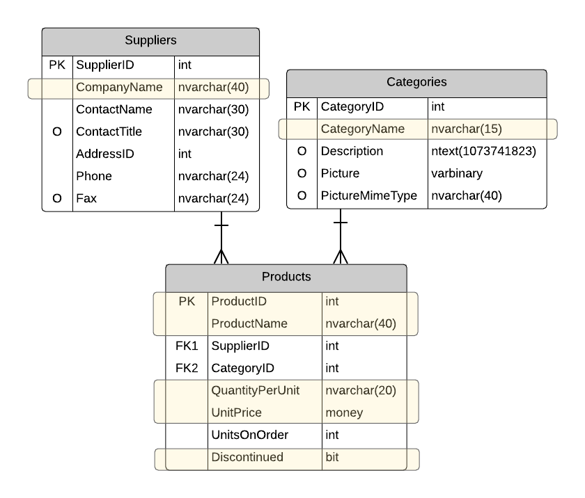

For the portion of the form that involves adding new products, we need the ability to select the supplier and category of the product.

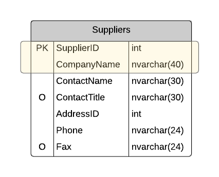 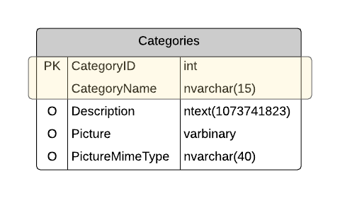

When a new product is being added, the **Products** table will be modified.

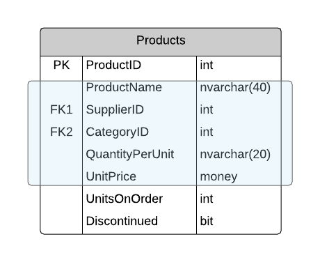

When existing products are being modified, only the unit price is to be changed.

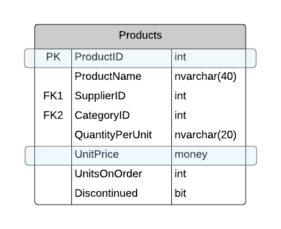

----

### UI Interactions

- **`Page_Load`**
  - No products will be displayed unless a partial product name has been entered.
  - *DropDownList* controls will call BLL methods for
    - **Suppliers** - `List<SelectionItem> ListSuppliers()`
    - **Categories** - `List<SelectionItem> Categories()`
- **`_Click()`** - for the **Filter by Partial Product Name** button - this should call a method in the BLL: `List<ProductDetails> GetProducts(string partialName, bool includeDiscontinued)`, and then it will populate the `<asp:ListView>` with the result.
- **`_OnItemCommand()`**
  - for the `CommandName` of **"Insert"**
    - We will call the BLL method: `void AddProduct(NewProduct item)`
  - for the **"Discontinue"** `CommandName`
    - we will call this method in the BLL: `void DiscontinueProduct(productId)`
    - the ListView needs to be refreshed with the fact that the product is now discontinued
  - for the `CommandName` of **"Edit"**, we will let the default ListView behaviour happen (put that row in "Edit Mode")
  - for the `CommandName` of **"Update"**
    - We will call the BLL method: `void ChangePrice(ProductPrice item)`


### BLL

The BLL will consist of an **`InventoryController`** supporting the following methods:

```csharp
public List<ProductDetails> GetProducts(string partialName, bool IncludeDiscontinued)
{ /* query from Products, Suppliers, & Categories */ }

public List<SelectionItem> ListCategories()
{ /* query from Categories */ }

public List<SelectionItem> ListSuppliers()
{ /* query from Suppliers */ }

public void DiscontinueProduct(productId)
{ /* command affecting Products*/ }

public void AddProduct(NewProduct item)
{ /* command affecting Products */ }

public void ChangePrice(ProductPrice item)
{ /* command affecting Products */ }
```

### View Models

```csharp
public class ProductDetails
{
    public int ProductID { get; set; }
    public string ProductName { get; set; }
    public string QuantityPerUnit { get; set; }
    public string Category { get; set; }
    public string Supplier { get; set; }
    public decimal SellingPrice { get; set; }
    public bool IsDiscontinued { get; set; }
}
```

```csharp
public class NewProduct
{
    public string ProductName { get; set; }
    public string QuantityPerUnit { get; set; }
    public int Category { get; set; }
    public int Supplier { get; set; }
    public decimal SellingPrice { get; set; }
}
```

```csharp
public class ProductPrice
{
    public int ProductID { get; set; }
    public decimal SellingPrice { get; set; }
}
```

----

<div class="divider"></div>

----

# Customer Orders

* [The Backstory](#the-backstory)
* [Planning Your Implementation](#planning-your-implementation)
* [Documenting Your Implementation Plan](#documenting-your-plan)

## The Backstory

The customers of **WestWind Wholesale &reg;** place their orders by phone or fax. Employees then enter the details of the order into the system via the **Customer Order Form** (from the *Sales* menu item on the website).

This form is also used to view completed orders whose products have already been shipped to the customer.

When the sales representative first opens the form, all they see is a simple drop-down list for selecting a customer.


Once a customer is selected, the rest of the form populates. Initally, the form focuses on showing the Order History view of the customer. The sales rep can then either 

- View details on a shipped order
- Create a new order
- Edit an "open" order

<!--

-->

| Order History | Editing Orders |
|:-----:|:---:|
|  |  |


### Editing New / Open Orders

The form allows employees to create new orders and view previous orders. Any order whose *Order Date* has been set cannot be modified, because that order has been *"Placed"*.

An order without an Order Date can be modified. It may be an order that is *"In Progress"* (saved, but not placed), or an entirely new order.

| New Order | Open Order - *In Progress* |
|--|--|
| 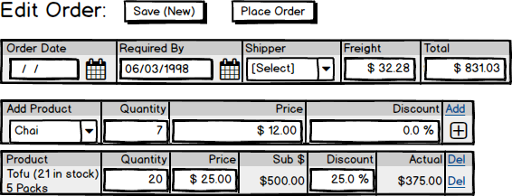 |  |

### Saving/Placing Orders

Saving and placing customer orders is something that has to be done as part of a **transaction**. The following sequence diagram supplied by the analysts illustrates the transactional behaviour that is represented by the **Save** command on the system.

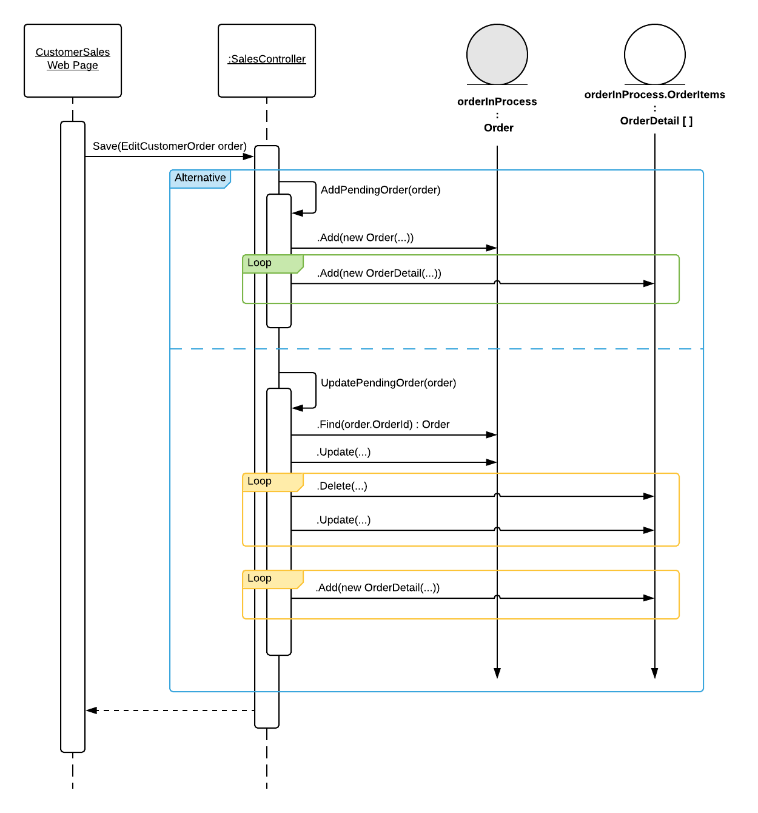

----

## Planning Your Implementation

### Examining the Database

#### Querying the Customer's Order History


The list of existing customers needs to draw information from the **Customers** tables. When a given customer is selected, we will then need the contact info for that customer.

| `SelectionItem` View Model | `CustomerContactInfo` View Model |
|--|--|
| 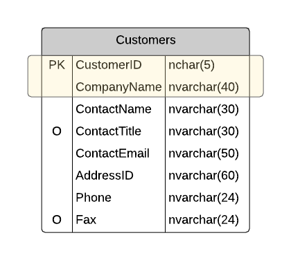  | 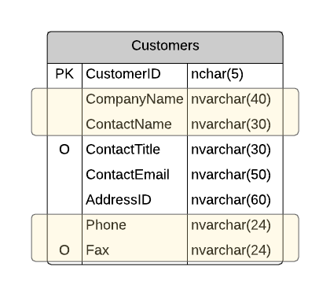 |

Selecting a customer from the drop-down will also cause a query of the orders made by that customer. Those orders may be **completed** (shipped) orders or **open** orders (*partially-shipped orders* or *orders that have been started but not yet been placed*). This would be represented in an **`OrderSummary`** view model.

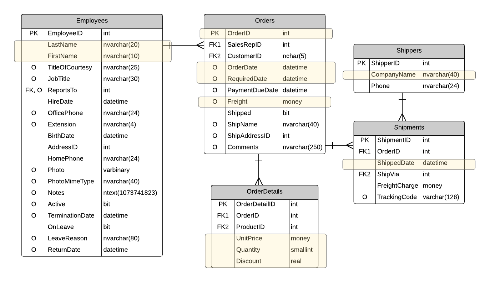

----

## Documenting Your Plan

### UI Interactions

- **`Page_Load`** - Have a list of the customers in a DropDownList. This will be from the BLL method `List<SelectionItem> ListCustomers()`
- **`_SelectedIndexChanged()`** for the **CustomersDropdown** control:
  - The customer information will be obtained from the BLL method `CustomerContactInfo GetCustomerContact(int customerId)`
  - The list of orders comes from the BLL method `List<OrderSummary> ListCustomerOrders(int customerId, bool shippedOnly)`
    - The `shippedOnly` will be `true` for this call.
    - The `List<OrderSummary>` will be used to populate a **GridView** called **CustomerOrdersGridView**.
- **`_SelectedIndexChanged()`** for the **OrderFilterRadioButtonList** control:
  - The list of orders comes from the BLL method `List<OrderSummary> ListCustomerOrders(int customerId, bool shippedOnly)`
    - The `shippedOnly` will be based on which radio button option was picked.
    - The `List<OrderSummary>` will be used to populate a **GridView** called **CustomerOrdersGridView**.
- **`_OnItemCommand()`** for the **EditOrder** button in the **CustomerOrdersGridView** will get order details from the BLL method `CustomerOrder GetCustomerOrder(int orderId)` and populate the Edit Order form
- **`NewOrder_Click()`** - Preps the Edit Order form for creating a new order. (Querying for drop-downs - via ObjectDataSource control)
- **`SaveOrder_Click()`** - Gathers information from the form and calls the BLL method `void Save(EditCustomerOrder order)`
- **`PlaceOrder_Click()`** - Gathers information from the form and calls the BLL method `void PlaceOrder(EditCustomerOrder order)`


### BLL

The BLL will consist of an **`SalesController`** supporting the following methods:

```csharp
public List<SelectionItem> ListCustomers()
{ /* query from Customers */ }

public CustomerContactInfo GetCustomerContact(int customerId)
{ /* query from Customers */ }

public List<OrderSummary> ListCustomerOrders(int customerId, bool shippedOnly)
{ /* query from Orders, Employees, OrderDetails, Shipments, Shippers */ }

public CustomerOrder GetCustomerOrder(int orderId)
{ /* query from Orders, OrderDetails, Products */ }

public void Save(EditCustomerOrder order)
{ /* command modifying Orders, OrderDetails */ }

public void PlaceOrder(EditCustomerOrder order)
{ /* command modifying Orders, OrderDetails */ }
```

### View Models

#### Queries

```csharp
public class CustomerContactInfo
{
    public string CompanyName { get; set; }
    public string ContactName { get; set; }
    public string Phone { get; set; }
    public string Fax { get; set; }
}
```

```csharp
public class OrderSummary
{
    public int OrderId { get; set; }
    public DateTime SalesRep { get; set; }
    public DateTime OrderDate { get; set; }
    public DateTime RequiredDate { get; set; }
    public string Shipper { get; set; }
    public decimal FreightCharges { get; set; }
    public decimal OrderTotal { get; set; }
}
```

```csharp
public class CustomerOrder
{
    public DateTime RequiredDate { get; set; }
    public decimal Freight { get; set; }
    public IEnumerable<OrderItems> Items { get; set; }
}
```

```csharp
public class OrderedItems
{
    public int OrderDetailId { get; set; }
    public int ProductId { get; set; }
    public decimal Price { get; set; }
    public short Quantity { get; set; }
    public double Discount { get; set; }
    public string ProductName { get; set; }
    public string QuantityPerUnit { get; set; }
}
```

#### Commands

```csharp
public class EditCustomerOrder
{
    public int? OrderId { get; set; }
    public DateTime RequiredDate { get; set; }
    public decimal Freight { get; set; }
    public List<ItemOrdered> Items { get; set; }
}
```

```csharp
public class ItemOrdered
{
    public int? OrderDetailId { get; set; }
    public int ProductId { get; set; }
    public decimal Price { get; set; }
    public short Quantity { get; set; }
    public double Discount { get; set; }
}
```

----

<div class="divider"></div>

----

# Order Processing

----


----

<div class="divider"></div>

----

# H1

## H2

### H3


<style>
.divider {
    height: 60px;
    width: 100%;
    background-color: darkgray;
}
h1 {
    border-top: solid thin black;
    background-color: #00BFFF55; /* DeepSkyBlue w. alpha */
    padding-left: 10px;
    font-weight: bold;
    color: #0040ff; /* Analagous for DeepSkyBlue */
}
h2{
    color: #0040ff;
    border-top: solid thin #DCDCDC; /* Gainsboro */
}
h3{
    background-color: #DCDCDC99; /* Gainsboro w. alpha */
    padding-left: 5px;
}
</style>
